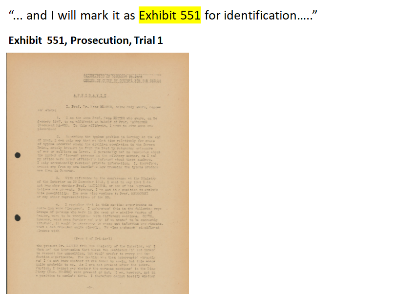

## Introduction
During my time at Insight Data Science, I consulted for [tolstoy.ai](https://tolstoy.ai/). The specializes in applying Natural Language Processing to analyzing large corpus of text data. The client of the company who requested this project is the law school of a prominent university. As part of its long-term effort to digitize and analyze the huge corpus of legal documents in its archive, it has enlisted the help of the company to process some of these documents and more efficiently extract structured content from the text.  

## Problem Statement
The school has, in its archive, the transcript of the   

## Create Training Set

## Feature Engineering 

## Classification

## Performance Evaluation

## Future Extensions
